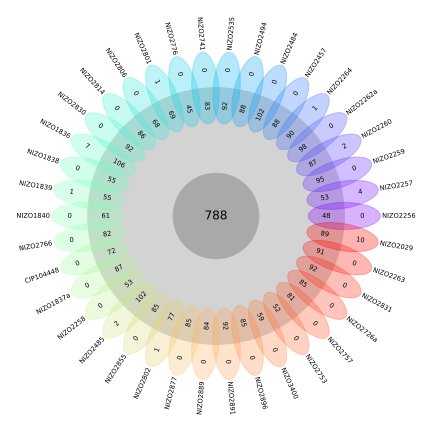
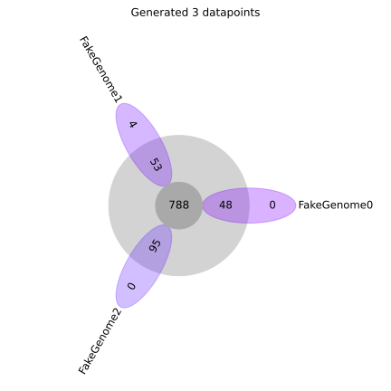

# Flower plot

A Python 3.9+ function that makes flower plots.

## Installation

This package requires at least `Python 3.9`.

```bash
pip install git+https://github.com/MrTomRod/flower-plot.git
```

## Example



## Usage

```python
# some data:
genome_to_data = {
    'FakeGenome0': {'color': (0.500, 0.000, 1.000), 'shell': 48, 'unique': 0},
    'FakeGenome1': {'color': (0.452, 0.073, 0.999), 'shell': 53, 'unique': 4},
    'FakeGenome2': {'color': (0.398, 0.159, 0.996), 'shell': 95, 'unique': 0}
}

import matplotlib.pyplot as plt
from flower_plot import flower_plot

flower_plot(genome_to_data=genome_to_data, n_core=788)
plt.tight_layout()
plt.show()
```

Result:



Arguments:

```text
genome_to_data:   dictionary that maps genome names to associated data (color, number of unique and shell genes)
n_core:           number of core genes
shell_color:      color of the shell circle
core_color:       color of the core circle
alpha:            opacity of the ellipses
rotate_shell:     whether to rotate the number of shell genes text
rotate_unique:    whether to rotate the number of unique genes text
rotate_genome:    whether to rotate the genome name
default_fontsize: font size for number of genes and genome name
core_fontsize:    font size for number of core genes
ax:               matplotlib axis
```